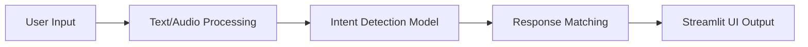

# 🎓 AI Chatbot for University Help Desk

An intelligent, context-aware AI chatbot designed for a University Help Desk. This application uses Natural Language Processing (NLP) to understand student inquiries and provide accurate, instantaneous answers about exams, courses, and deadlines.

## 🔥 Key Features

- **🧠 Smart Matching intent detection**: Uses `scikit-learn` (TF-IDF Vectorization + Logistic Regression) and `NLTK` (Lemmatization) to handle varied user phrasing (e.g., "when is the exam?", "date of exam?").
- **📊 Real Data Integration**: Knowledge base is safely decoupled in `data/intents.json` for easy scaling, dynamic updates, and simple management without touching code.
- **🎯 Confidence Scoring**: Transparency first! The UI displays the predicted intent alongside its confidence percentage, proving the AI’s certainty.
- **💬 Persistent Chat History**: The Streamlit interface securely retains the entire conversation natively in `session_state`.
- **🎙️ Advanced Voice Input**: Support for voice commands using `streamlit-mic-recorder` and Google Web Speech API for seamless audio-to-text querying directly from the browser.

## 🏗️ System Design



## 🚀 Installation & Setup

1. **Clone the repository**:
   Ensure you have Python 3.8+ installed. 
   
2. **Install dependencies**:
   Run the following command to retrieve all required packages:
   ```bash
   pip install -r requirements.txt
   ```

3. **Provide NLTK Tokens (if not auto-downloaded)**:
   The application downloads required NLTK resources automatically on launch.

4. **Launch the Web App**:
   Start the Streamlit application using the command:
   ```bash
   streamlit run app.py
   ```

## 📂 Project Structure

- `app.py`: Main Streamlit application and UI logic (Frontend).
- `src/nlp_engine.py`: ML pipeline handling preprocessing, model training, and predictions.
- `data/intents.json`: The "database" holding the intents, user variation phrases, and responses.
- `requirements.txt`: Project dependencies.

---
*Developed for a powerful, fast, and interactive demonstration of Applied NLP capabilities.*
